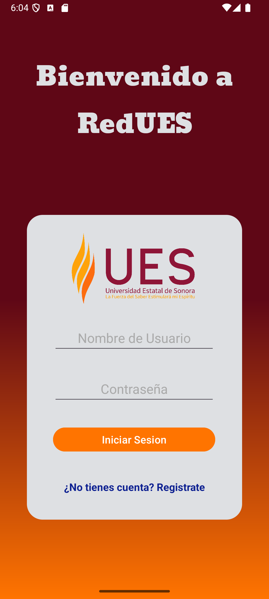
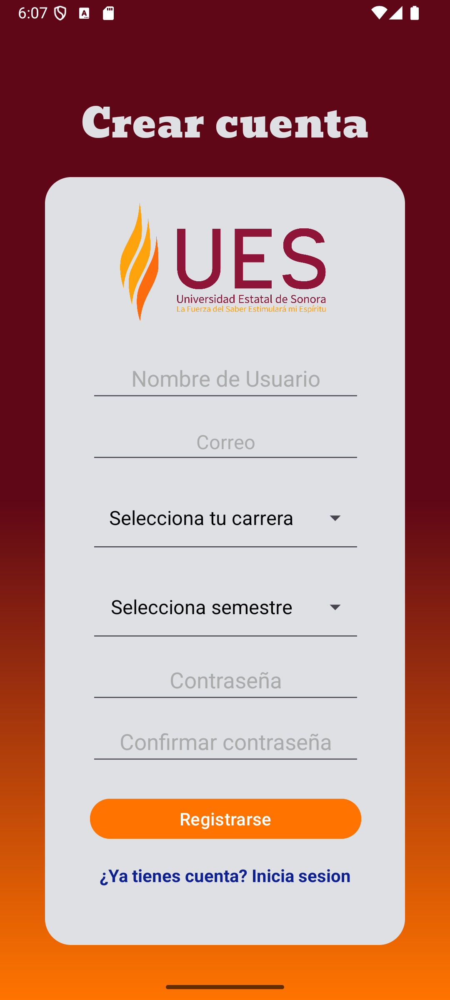
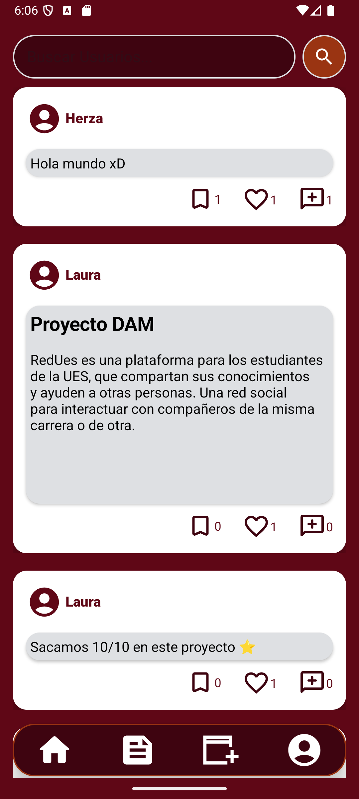
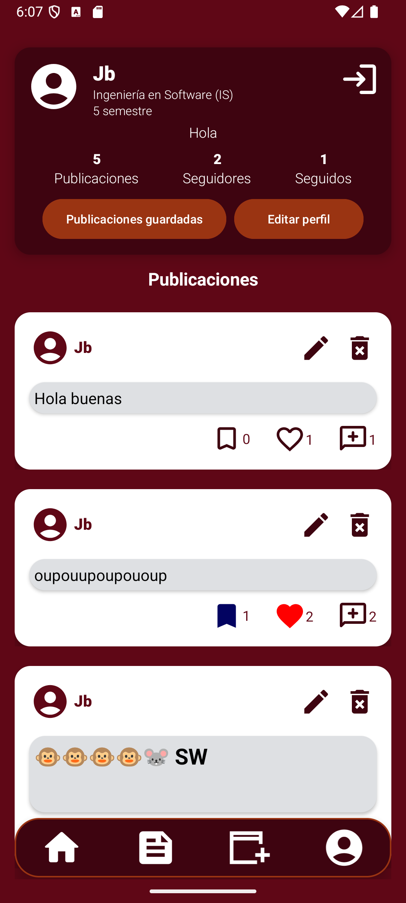
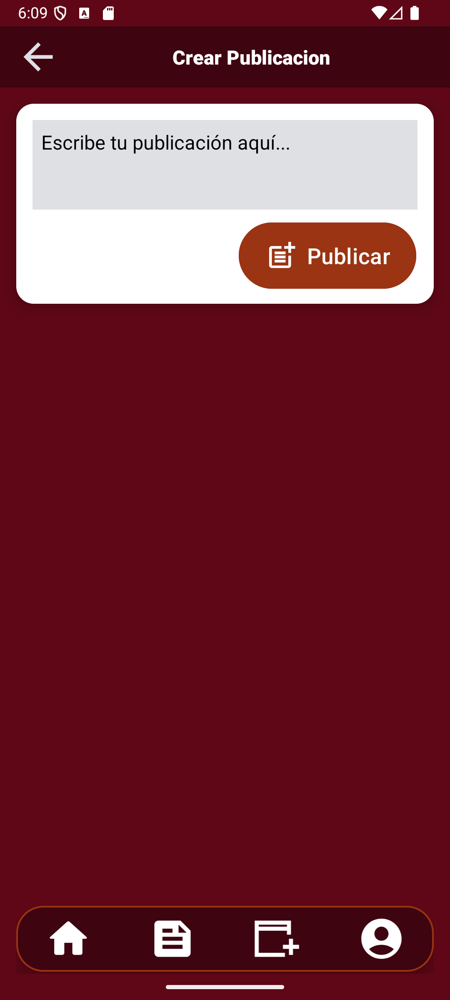
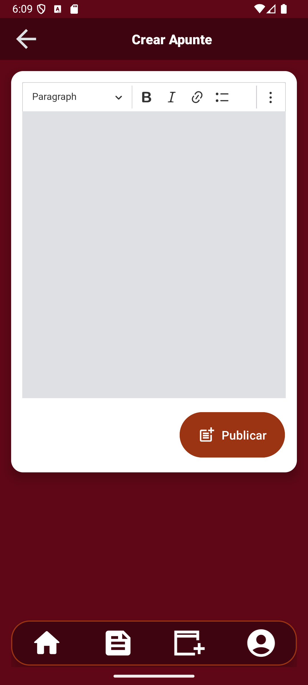
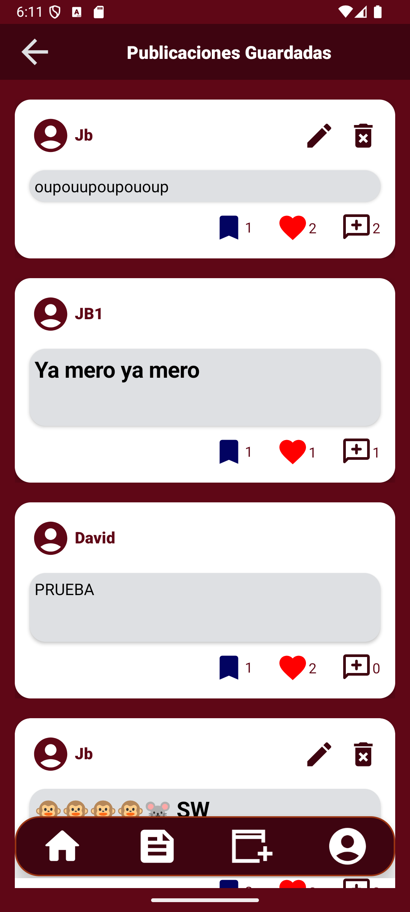

<div align="center">

<br/>

```
██████╗ ███████╗██████╗ ██╗   ██╗███████╗███████╗
██╔══██╗██╔════╝██╔══██╗██║   ██║██╔════╝██╔════╝
██████╔╝█████╗  ██║  ██║██║   ██║█████╗  ███████╗
██╔══██╗██╔══╝  ██║  ██║██║   ██║██╔══╝  ╚════██║
██║  ██║███████╗██████╔╝╚██████╔╝███████╗███████║
╚═╝  ╚═╝╚══════╝╚═════╝  ╚═════╝ ╚══════╝╚══════╝
```

### 🎓 La versión mobile de RedUES

<br/>

[](https://developer.android.com)
[](https://kotlinlang.org)
[](https://developer.android.com/about/versions/nougat)
[](https://square.github.io/retrofit/)
[](https://developer.android.com/topic/libraries/architecture/paging/v3-overview)
[](https://jwt.io)

<br/>

> *Conecta. Comparte. Aprende. Todo dentro de la comunidad UES.*

<br/>

</div>

---

## ¿Qué es RedUES?

**RedUES** es una plataforma social construida **exclusivamente** para la comunidad de la Universidad Estatal de Sonora. Permite a estudiantes conectarse, compartir publicaciones, crear apuntes enriquecidos, comentar, dar likes, guardar contenido y seguir a otros compañeros — todo desde su dispositivo Android.

El proyecto nació para resolver una necesidad real: un espacio digital propio de la UES, con contexto académico (carrera, semestre) y sin el ruido de las redes sociales generalistas. En esta ocasion esta presente la version para Android.

---

## Funcionalidades principales

### 🔐 Autenticación
- Registro con nombre de usuario, correo, carrera y semestre
- Login con JWT almacenado de forma cifrada mediante **Jetpack Security (EncryptedSharedPreferences)**
- Sesión persistente con validación de expiración automática
- Auto-login al abrir la app si el token sigue vigente

### 📰 Feed de publicaciones
- Carga paginada infinita con **Paging 3** (10 publicaciones por página)
- Dos tipos de contenido: **Publicaciones** (texto plano) y **Apuntes** (HTML enriquecido con editor CKEditor)
- Pull-to-refresh con indicador visual
- Visualización diferenciada de apuntes con soporte de links y formato HTML

### ❤️ Interacciones sociales
| Acción | Descripción |
|--------|-------------|
| **Like** | Toggle instantáneo con animación bounce, optimistic update |
| **Guardar** | Guarda publicaciones en tu colección personal |
| **Comentar** | Bottom Sheet con lista de comentarios + envío en tiempo real |
| **Seguir** | Sigue o deja de seguir a cualquier usuario |

### 👤 Perfiles de usuario
- Vista pública: publicaciones, seguidores, seguidos, carrera y semestre
- Vista propia: edición de perfil (bio, carrera, semestre) con animación de overlay
- Botones contextuales: editar perfil / seguir / publicaciones guardadas según si es tu propio perfil o el de otro usuario

### ✏️ Creación de contenido
- **Publicación simple**: texto plano con validación de contenido vacío
- **Apunte enriquecido**: editor WYSIWYG (CKEditor) cargado en un `WebView` con soporte para HTML, negritas, links, listas, etc.
- **Edición y eliminación** de tus propias publicaciones (con diálogo de confirmación para eliminar)

### 🔍 Búsqueda de usuarios
- Busca compañeros por nombre de usuario
- Resultados en un overlay animado con lista deslizable
- Acceso directo al perfil desde los resultados

### 💾 Publicaciones guardadas
- Sección dedicada accesible desde el perfil
- Misma experiencia de feed con paginación y refresh

---

## Arquitectura y stack técnico

```
RedUES Mobile
│
├── data/
│   ├── api/              ← Interfaces Retrofit (Auth, Publicaciones, Likes, Comentarios...)
│   ├── dto/              ← Data Transfer Objects (Request/Response)
│   ├── auth/             ← TokenManager (JWT) + AuthInterceptor (OkHttp)
│   └── RetrofitInstance  ← Configuración centralizada del cliente HTTP
│
└── ui/
    ├── MainActivity       ← Login
    ├── RegisterActivity   ← Registro + Spinners de carrera/semestre
    ├── FeedActivity       ← Feed principal + búsqueda de usuarios
    ├── Perfil             ← Perfil propio y ajeno + edición
    ├── Publicacion        ← Crear publicación simple
    ├── Apunte             ← Crear apunte con editor HTML (WebView + CKEditor)
    ├── EditarPublicacion  ← Editar publicación o apunte existente
    ├── GuardadosActivity  ← Feed de publicaciones guardadas
    ├── PostAdapter        ← PagingDataAdapter con DiffUtil + acciones
    ├── ComentarioAdapter  ← Lista de comentarios con tiempo relativo
    ├── CommentsBottomSheetFragment ← Sheet de comentarios
    ├── PostPagingSource   ← Fuente de datos paginada (reutilizable)
    ├── NavigationHelper   ← Navegación inferior centralizada
    └── OnPostActionListener ← Interfaz + implementación de acciones del feed
```

### Decisiones técnicas destacadas

**Paging 3 con `PostPagingSource` reutilizable**
La misma clase `PostPagingSource` sirve para tres vistas distintas (feed general, perfil de usuario, guardados) gracias a parámetros opcionales. Esto evita duplicar lógica de paginación.

**Optimistic UI en likes y guardados**
Al pulsar like o guardar, el estado se actualiza visualmente de forma inmediata sin esperar la respuesta del servidor. Si falla la llamada, se revierte automáticamente. Esto da una experiencia percibida mucho más fluida.

**JWT en EncryptedSharedPreferences**
El token se guarda cifrado con AES-256. El `TokenManager` también decodifica el payload del JWT para extraer `userId` y `userName` localmente, sin llamadas extra al servidor.

**Apuntes con CKEditor en WebView**
Los apuntes usan un editor HTML completo cargado desde `assets/editor.html`. La comunicación entre Kotlin y JavaScript se hace mediante `evaluateJavascript`, permitiendo leer y escribir el contenido del editor de forma bidireccional.

**`ActivityResultLauncher` para edición**
Al editar una publicación, se usa el patrón `registerForActivityResult` para que al volver, el feed o perfil hagan refresh automático si la edición fue exitosa.

---

## Requisitos previos

- **Android Studio Iguana** o superior
- **JDK 17**
- **Android 7.0 (API 24)** o superior en el dispositivo/emulador
- Backend **RedUES API** activo (ver sección de configuración)

---

## Instalación y configuración

### 1. Clonar el repositorio

```bash
git clone https://github.com/tu-usuario/RedUesMobile.git
cd RedUesMobile
```

### 2. Configurar la URL del backend

Abre `app/src/main/java/com/example/reduesmobile/data/RetrofitInstance.kt` y ajusta la constante:

```kotlin
const val BASE_URL = "https://redues.runasp.net/api/"
// Cámbiala si tienes el backend en local, por ejemplo:
// const val BASE_URL = "http://10.0.2.2:5000/api/"  ← emulador apuntando a localhost
// const val BASE_URL = "http://192.168.1.x:5000/api/" ← dispositivo físico en la misma red
```

### 3. Compilar y ejecutar

```bash
# Desde Android Studio
1. File → Sync Project with Gradle Files
2. Run → Run 'app'
3. Selecciona un emulador o dispositivo con Android 7.0+
```

---

## Endpoints consumidos

| Módulo | Método | Endpoint |
|--------|--------|----------|
| Auth | `POST` | `/v1/auth/login` |
| Auth | `POST` | `/v1/auth/register` |
| Publicaciones | `GET` | `/v1/publicaciones?page=&pageSize=` |
| Publicaciones | `GET` | `/v1/publicaciones/usuarios/{id}` |
| Publicaciones | `POST` | `/v1/publicaciones` |
| Publicaciones | `PUT` | `/v1/publicaciones/{id}` |
| Publicaciones | `DELETE` | `/v1/publicaciones/{id}` |
| Comentarios | `GET` | `/v1/publicaciones/{id}/comentarios` |
| Comentarios | `POST` | `/v1/publicaciones/{id}/comentarios` |
| Comentarios | `DELETE` | `/v1/publicaciones/comentarios/{id}` |
| Likes | `POST` | `/v1/publicaciones/{id}/likes` |
| Guardados | `GET` | `/v1/publicaciones/guardados` |
| Guardados | `POST` | `/v1/publicaciones/{id}/guardados` |
| Usuarios | `GET` | `/v1/usuarios?usuario=` |
| Usuarios | `GET` | `/v1/usuarios/perfiles/{id}` |
| Usuarios | `PUT` | `/v1/usuarios/perfiles` |
| Seguidores | `POST` | `/v1/usuarios/{id}/seguidores` |
| Seguidores | `DELETE` | `/v1/usuarios/{id}/seguidores` |

---
## Capturas de pantalla

<div align="center">

<table>
  <tr>
    <td align="center"><b>Login</b></td>
    <td align="center"><b>Registro</b></td>
    <td align="center"><b>Feed principal</b></td>
    <td align="center"><b>Perfil de usuario</b></td>
  </tr>
  <tr>
    <td></td>
    <td></td>
    <td></td>
    <td></td>
  </tr>
  <tr>
    <td align="center"><b>Crear publicación</b></td>
    <td align="center"><b>Crear apunte</b></td>
    <td align="center"><b>Guardados</b></td>
    <td></td>
  </tr>
  <tr>
    <td></td>
    <td></td>
    <td></td>
  </tr>
</table>

</div>

---

## Contribuidores

| Nombre | Rol |
|--------|-----|
| **JB** | Desarrollo completo — Android / Kotlin |
| **JQ** | Desarrollo completo — Android / Kotlin |
| **LG** | Desarrollo completo — Android / Kotlin |
| **DG** | Desarrollo completo — Android / Kotlin |

¿Quieres contribuir? Abre un **issue** o un **pull request**. Las contribuciones son bienvenidas.

---

## Licencia

Este proyecto está bajo la licencia **MIT**. Consulta el archivo [`LICENSE`](LICENSE) para más detalles.

---

<div align="center">

**RedUES Mobile** · Hecho con ❤️ para la comunidad UES

⭐ Si este proyecto te fue útil, ¡dale una estrella!

</div>
